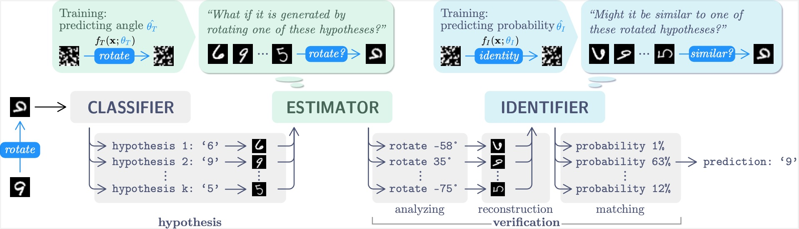

# Toward Extracting and Exploiting Generalizable Knowledge of Deep 2D Transformations in Computer Vision

This repository contains the code implementation of paper **Toward Extracting and Exploiting Generalizable Knowledge of Deep 2D Transformations in Computer Vision**

## Abstract

The existing deep learning models suffer from out-of-distribution (o.o.d.) performance drop in computer vision tasks. In comparison, humans have a remarkable ability to interpret images, even if the scenes in the images are rare, thanks to the generalizability of acquired knowledge. This work attempts to answer two research questions: 1) the acquisition and 2) the utilization of generalizable knowledge about 2D transformations. To answer the first question, we demonstrate that deep neural networks can learn generalizable knowledge with a new training methodology based on synthetic datasets. The generalizability is reflected in the results that, even when the knowledge is learned from random noise, the networks can still achieve stable performance in parameter estimation tasks. To answer the second question, a novel architecture called **InterpretNet** is devised to utilize the learned knowledge in image classification tasks. The architecture consists of an Estimator and an Identifier, in addition to a Classifier. By emulating the "hypothesis-verification" process in human visual perception, our InterpretNet improves the classification accuracy by 21.1%.

## InterpretNet Architecture



## To run the codes

### Environment

This codebase was tested with the following environment configurations. It may work with other versions.
- RHEL 7.9
- CUDA 11.1
- GCC 8.5.0
- Python 3.9.7
- PyTorch 1.9.1

### Train the Estimator
  ```shell
  python main.py with train_identifier=False
  ```

### Train the Identifier
  ```shell
  python main.py with train_identifier=True \
  estimator_path=<path/to/trained/estimator/model>
  ```

### Evaluate with InterpretNet
  ```shell
  python evaluation.py with \
  classifier_path=<path/to/trained/classifier/model> \
  estimator_path=<path/to/trained/estimator/model> \
  identifier_path=<path/to/traind/identifier/model>
  ```

## Disclaimer

Some of our codes reuse the github project [AET](https://github.com/maple-research-lab/AET).  

## License

Our code is released under the MIT License.
